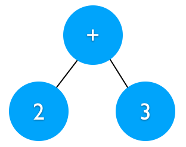
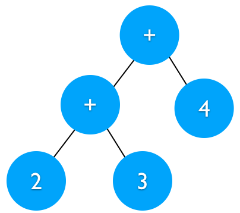
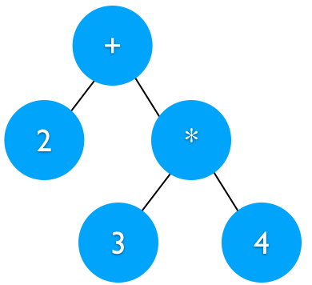

# Grammars, Abstract Syntax Trees, and Parsing #

This covers some background about how compilers and interpreters read in and understand input programs.
This is fairly minimal, and is not intended to be a complete discussion of this problem.
For a more complete view, you may wish to refer to [this document](https://ucsb-cs56-pconrad.github.io/tutorials/parsing/), specifically all the links underneath the "More on parsing" section.


## Grammars ##

Before we can start reading in programs, we need to answer a basic question: what _is_ a valid program?
Without a definition of validity, we don't really know what we need to read in, nor how to interpret it.
For example, we need a way of saying the arithmetic expressions `1` and `2 + 3` are valid, but that `1foo + 2` is not valid.

In order to define valid programs, we borrow the concept of [context-free grammars (CFGs)](https://en.wikipedia.org/wiki/Context-free_grammar) from linguistics.
True to their name, CFGs talk about the _grammar_ of a given language; that is, the rules governing where words can be placed in a _sentence_.
While CFGs were originally created to talk about natural languages, they are a good (and often better) fit for talking about programming languages.
In the context of a CFG, a program forms a complete sentence.

CFGs are often written in Backus-Naur form (BNF).
Let's explain BNF via example:

```
expr ::= integer | expr '+' expr
digit ::= '0' | '1' | '2' | '3' | '4' | '5' | '6' | '7' | '8' | '9'
integer ::= digit | digit integer
```

The above BNF describes arithmetic expressions which use `+`.
Each line is referred to as a _production rule_, and each part between the `|` (pipe) is a _production_`.
The part before the `::=` gives the name of the production rule.
The part after the `::=` says what it means to be a valid input for this production.
The `|` is effectively logical OR, stating that a given input could be one thing or another thing.
The use of single quotes (as with `'+'`) states that the specific string in the quotes must be present in the input, whereas a lack of quotes indicates the use of another production.

With all this in mind, let's do a rough translation of the above BNF into plain English.
We'll start with the first line: `expr ::= integer | expr '+' expr`.
This says:

- `expr ::=`: An `expr` (short for "expression") is...
- `integer`: Whatever the `integer` production rule accepts...
- `|`: ...or...
- `expr '+' expr`: Whatever `expr` accepts, followed by a `+` character, followed by whatever `expr` accepts.
  You can think of following one part directly with another as logical AND.

This shows that production rules are permitted to be recursive, which is necessary for most practical languages.
For example, most languages allow you to nest `if` as many levels deep as you want; this is becuase their grammars are defined recursively, allowing for `if` to be defined within an `if`.

Onto the second and third lines.
This line states that a `digit` is either `0`, `1`, ..., `9`.
With this in mind `digit` accepts single-digit integers.
The third line (`integer ::= digit | digit integer`) is used to accept possibly multi-digit integers.
Specifically, this states:

- `integer ::=`: An `integer` is...
- `digit`: ...whatever `digit` accepts...
- `|`: ...or...
- `digit integer`: ...whatever `digit` accepts, followed by whatever `integer` accepts.
  Here, we use recursion to repeatedly accept single-digit integers, collectively allowing for multi-digit integers of arbitrary length.

While this example is relatively small, this covers all the essentials of BNF.
With these same concepts, we can define a grammar describing complete programming languages.


## Abstract Syntax Trees ##

While we can use grammars to talk about the validity of programs, we usually care about more than just validity.
Specifically, we want to be able to read in the program and interpret its meaning.
For this purpose, it's inconvenient to work with the raw input from the programmer, which is effectively a big string.
To understand why this is inconvenient, let's consider the following snippets, one per line:

```
int x=1+2;
int x = 1 + 2;
int x = 1 + 2; // set x to 3
int x = (1 + 2);
int x = ((1) + (2));
```

Each one of these snippets is different.
However, from the standpoint of a compiler/interpreter, they all do the _exact_ same thing.
While it can be convenient for humans to have different ways of writing the same thing, we intentionally don't want these to be treated differently.
To that end, it's better if the compiler/interpreter uses a [canonical form](https://en.wikipedia.org/wiki/Canonical_form) of some sort to treat these uniformly.

The canonical form which is almost universally used is that of an [abstract syntax tree (AST)](https://en.wikipedia.org/wiki/Abstract_syntax_tree).
While this name sounds complex, each one of its parts says a lot about what we're working with:

- "abstract": it removes any non-essential details, e.g., how much whitespace was used, if parentheses were present, if a comment was used, etc.
- "syntax": it describes what the programmer wrote
- "tree": it is a [tree](https://en.wikipedia.org/wiki/Tree_(graph_theory)), in the same way that a binary tree is a tree.
  However, these trees can have more complex structures than possible with binary trees.

Let's see some ASTs for some expressions:

`8`:


In this case, we just have a leaf node, holding the value `8`.

`2 + 3`:



Operations (like `+`) are placed in internal nodes in the tree.
The operands (`2` and `3`) are placed in child nodes.
The order of the child nodes matters; if this had been `3 + 2`, the values in the two child nodes would be swapped.

`2 + 3 + 4`:



Recalling the normal PEMDAS rules for arithmetic, addition is performed left-to-right.
This means that `2 + 3 + 4` is equivalent to `(2 + 3) + 4`.
This is represented in the AST by having the subtree for `2 + 3` nested below the `+` involving `4`.
This shows that `2 + 3` is at higher precedence; we have to add `2` and `3` before we can add `4`.
If the input expression had instead been `(2 + 3) + 4`, it would have resulted in the _exact same_ AST.
That is, given this AST, we don't know if the input were `2 + 3 + 4`, `(2 + 3) + 4`, `2+3+4`, etc.

`2 + 3 * 4`:



Recalling again the PEMDAS rules, this expression is equivalent to `2 + (3 * 4)`.
We see this in the tree structure, where the `3 * 4` must be evaluated before we can evaluate the addition.

